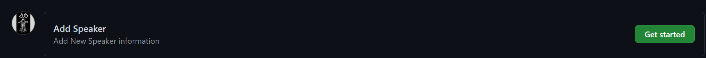
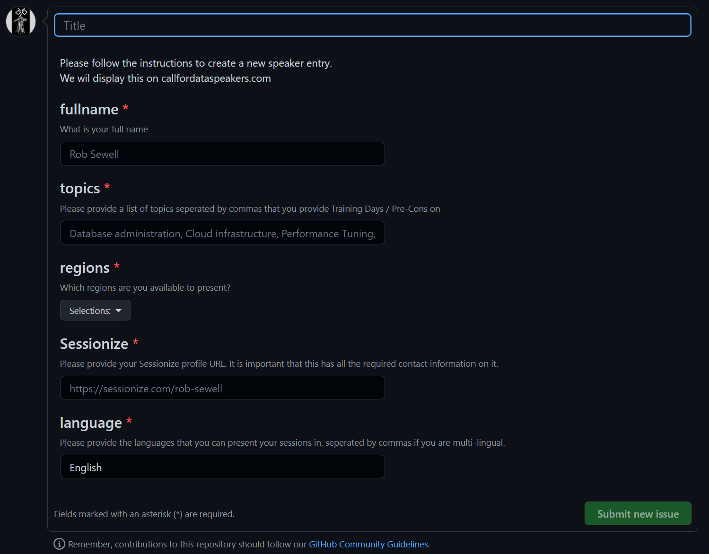
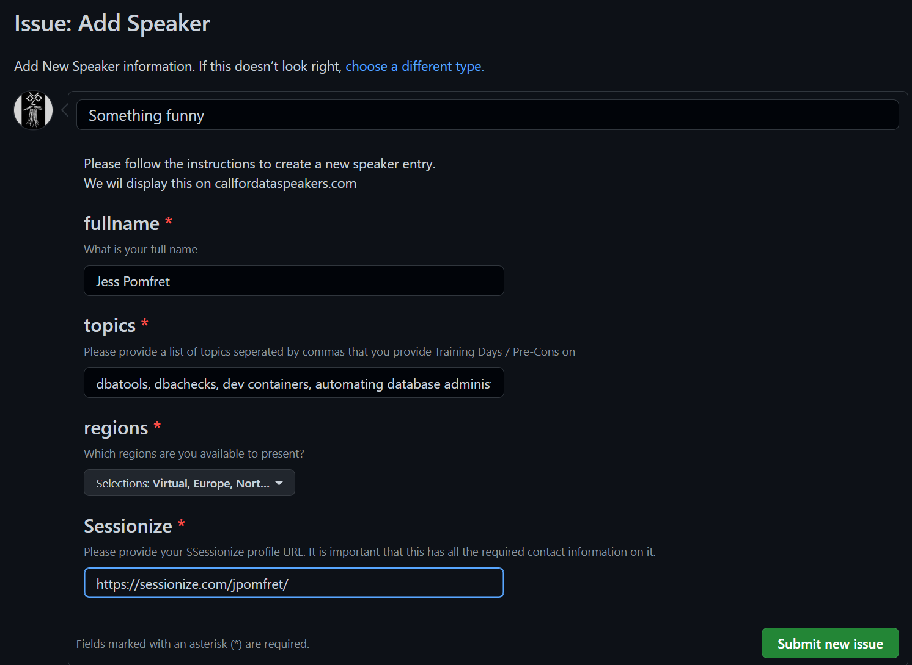

# A list of Speakers who provide training days
A simple repository to serve as a resource for event owners so that they can find speakers who can do training days. This has been identified as a gap in knowledge for event owners and reduces the diversity and growth of the Data training days (or pre-cons) pool. Of course, the famous names will already be approached and will provide excellent training days which will sell tickets and bring folks in to events. Hopefully, the web-page served by this repository will enable event owners to find and approach other speakers as well and then everyone will benefit.  
  
> "I would particularly like this to be a resource that amplifies the less well known, newer speakers in our community."  

says Rob and so this will require that you the visitor assist, by asking speakers to add themselves and by sharing the web-page with event owners and on social media.    
  
The data entered here will be loaded onto the [callfordataspeakers.com](https://callfordataspeakers.com/precon) website for consumption. 

Rob Sewell and Daniel Hutmacher
@SQLDBAWithABeard @dhmacher

# Code of conduct and expectations

By submitting, you are agreeing to [our code of conduct](https://raw.githubusercontent.com/dataplat/DataSpeakers/main/CODE_OF_CONDUCT.md)
       
If Rob is notified that you have broken the Code of Conduct at any event. **He WILL remove you from this list**.

If you see a speaker that you know has broken the Code of Conduct at an event. Please let Rob Sewell know. You can find methods to contact him here https://robsewell.com

This might seem extreme to some people for a simple little list of people, but it is important and we mean it. If you are thinking in this way then we suggest that you please go and listen and read and understand the reasons why. You are welcome to contact me for places to do this

## To add yourself as a speaker

This process is all automated and driven by GitHub Issues  

Open the [Issues Page](https://github.com/dataplat/DataSpeakers/issues) in this repository and click new issue

Click the get started button next to Add Speaker

Fill in the details, the title can be anything that you like

- Your full name
- topics you can provide training days or pre-cons for (dbatools, Index Tuning, DevOps for example) Add as many as you like.   
    **Just topics** not session titles or descriptions, those will be in your sessionize profile then this does not need updating so frequently
- regions that you would be willing to present training days or pre-cons in (these match the regions on callfordataspeakers.com)
- Your sessionize profile URl which will show the event organisers the precise sessions that you have and also your contact details/methods
- The languages that you can present in seperated by commas.

Thats it, then press Submit new issue and the automation will do its thing

## To remove yourself as a speaker

Delete your speaker name.json file and ask for the website workflow to be run
## To edit your speaker information

Either delete your speaker name.json file and then add a new issue or edit your speaker name.json file and ask for the website workflow to be run

# How it works

When an issue is created the on-issue GitHub Action is automatically triggered. This

- says thank you on the issue
- saves the issue form results to a file temporarily
- parses the temporary file and creates a speaker json file and saves it
- adds a comment to the issue and commits the change to the repo
- runs the websiteFile workflow which 
    - takes all the speaker json files and creates a new speaker-list.json which feeds the web-site
    - comments on the issue
    - commits all the changes and pushes them
- closes the issue
